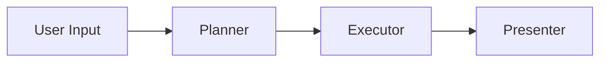

# 🛡️ Paladin

**Paladin** is a reasoning-driven command execution assistant designed to bridge natural language intent and controlled system interaction. It features a modern, "premium" web interface and a robust AI agent backend.

## ✨ Features

- **Linear Execution Pipeline:** User Input → Planner → Executor → Presenter.
- **Smart "AI Triage":** Suggests optimizations and fixes based on system analysis.
- **Dual Execution Modes:**
    - **Stable:** Executes only known, whitelisted commands (Safe).
    - **Experimental:** Allows unrestricted shell command execution (Beta/Unsafe).
- **Interactive Web Console:**
    - **Command Console:** Terminal-like chat interface with code block highlighting.
    - **Live Telemetry:** Real-time uptime and system status.
    - **Dynamic Settings:** Switch models (Ollama/Gemini) and modes instantly.
- **Demo Mode:** Fully simulated environment for testing UI without a backend.

## 🏗️ Project Structure

The project is organized into the following components:

- **`ai/`**: The core Python agent logic (FastAPI, LangGraph, Tools).
- **`frontend/`**: React/Vite Web UI with TailwindCSS & Shadcn/UI.
- **`api-gateway/`**: Node.js/Express Gateway routing requests.
- **`services/`**: Additional backend microservices.

## 🚀 Getting Started

### Prerequisites

- [Docker & Docker Compose](https://www.docker.com/) (Recommended for full stack)
- Python 3.11+ (For standalone agent)
- [Ollama](https://ollama.com/) (Recommended for local LLM privacy)

### Quick Start (Full Stack)

We provide convenience scripts to get you running instantly.

#### 1. Normal Mode (Requires Backend)
Starts the AI Agent, API Gateway, and Web UI.

```bash
./start.sh
```
Then open **http://localhost:5173/** in your browser.

#### 2. Demo Mode (UI Only)
Starts only the Frontend with simulated AI responses. Perfect for checking out the UI.

```bash
./start-demo.sh
```
Then open **http://localhost:5173/** in your browser.

### Manual Setup (Standalone Agent)

If you only want to run the core AI agent CLI:

```bash
cd ai
python -m venv venv
source venv/bin/activate
pip install -r requirements.txt
cp config.example.toml config.toml
python cli.py
```

## ⚙️ Configuration

Configuration is managed via the Web UI (Settings) or `ai/config.toml`.

| Setting | Description | Default |
| :--- | :--- | :--- |
| `provider` | The LLM provider (`ollama` or `gemini`). | `ollama` |
| `model` | Specific model to use (auto-detected for Ollama). | `ministral-3:3b` |
| `temperature` | Creativity of the model (0.0 - 1.0). | `0.2` |
| `timeout_seconds` | Max duration for command execution. | `15` |
| `mode` | `stable` (allowlist) or `experimental` (unrestricted). | `stable` |

## 🏗️ Architecture



- **Planner**: Interprets the user request and derives a single command.
- **Executor**: Executes the command under configured safety constraints.
- **Presenter**: Formats and summarizes the output for user consumption.

> ⚠️ **Security Warning**: Experimental mode allows real shell execution. Do not expose this service to untrusted networks.

---

*Disclaimer: Paladin is a tool for executing commands. Always review the commands generated before execution, especially in Experimental mode.*
